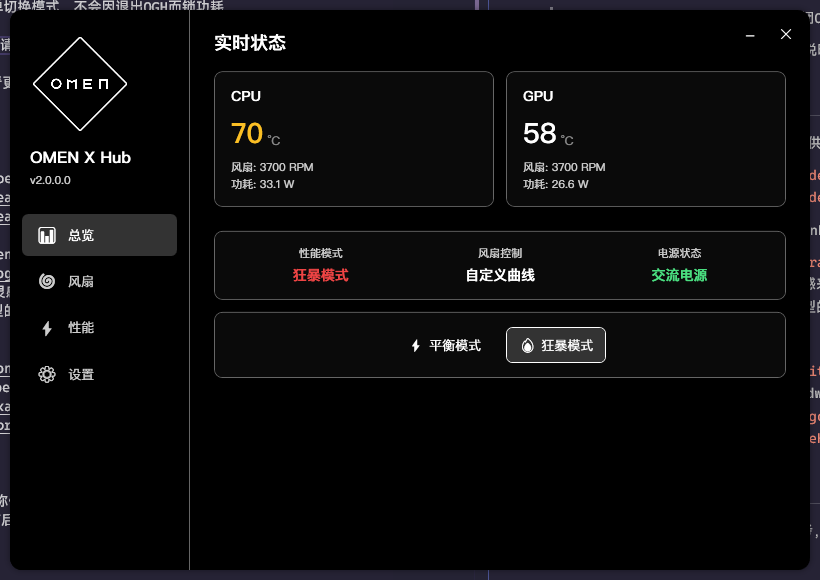

OMEN X Hub
=

本程序主要功能包括伪装OGH，风扇控制，CPU和GPU功率控制，DB版本切换，Omen键自定义以及温度/功率监控。
包含了惠普暗夜精灵（HP OMEN）系列的控制软件Omen Gaming Hub的大多数有用功能，但不连接网络，且没有广告、壁纸等无用功能。

* 程序设计主要基于暗影精灵10 Intel笔记本（i7-13650HX + RTX 4070），不保证能在所有平台正常运行

* 目前已知**能正常使用的机型**包括**暗影精灵8p，8pp，9，9p，10，光影精灵10**

* 目前已知**不支持的机型**包括**暗影精灵6**

* 在不支持的机型上使用可能出现无法读取数据、蓝屏或其他后果。

* 为了避免功能冲突，启动前应关闭OmenCommandCenterBackground进程或卸载OGH

* 在任务栏可查看信息或右键菜单切换模式，不会因退出OGH而锁功耗

* 要长时间使用本程序替代OGH，请关闭OGH自启动并开启OXH自启

* 在右键菜单“关于OXH”中可查看更多说明

致谢
=

* **breadeding** - OmenSuperHub 提供本项目主要框架及代码
  * https://github.com/breadeding
  * https://github.com/breadeding/OmenSuperHub

* **GeographicCone** - OmenMon OmenHwCtl
  * https://github.com/GeographicCone
  * 这两个项目是本项目的主要灵感来源，作者不仅给出了交互命令，还给出了探索OGH交互的方法，可惜的是缺少对较新机型的支持且已经停止更新，可能无法脱离OGH运行。

* **硬件监控核心库支持**
  * https://openhardwaremonitor.org/
  * **hexagon-oss** - 对OpenHardwareMonitor的硬件库进行了更新
  * https://github.com/hexagon-oss/openhardwaremonitor
  * https://github.com/LibreHardwareMonitor/LibreHardwareMonitor

免责声明
=
本程序不属于HP或Omen，品牌名称仅供参考，本程序与硬件交互，可能具有潜在危险或破坏性，使用者自行承担使用本程序的所有后果。
